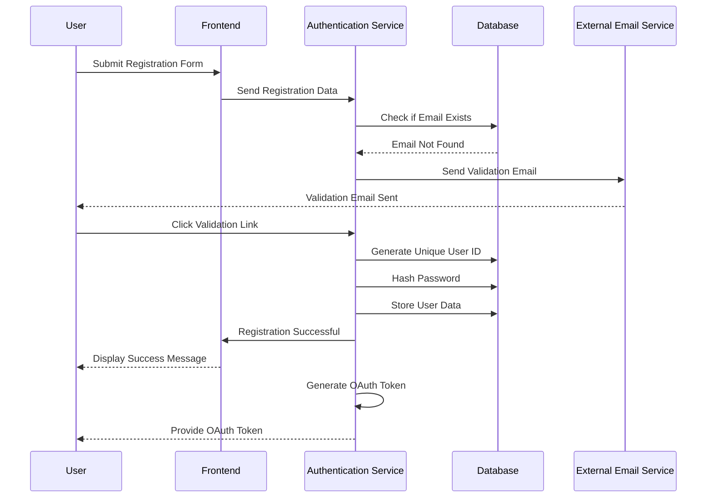

```mermaid
sequenceDiagram
    participant User
    participant Frontend
    participant AuthService as Authentication Service
    participant DB as Database
    participant EmailService as External Email Service

    User->>Frontend: Submit Registration Form
    Frontend->>AuthService: Send Registration Data
    AuthService->>DB: Check if Email Exists
    DB-->>AuthService: Email Not Found
    AuthService->>EmailService: Send Validation Email
    EmailService-->>User: Validation Email Sent
    User->>AuthService: Click Validation Link
    AuthService->>DB: Generate Unique User ID
    AuthService->>DB: Hash Password
    AuthService->>DB: Store User Data
    AuthService->>Frontend: Registration Successful
    Frontend-->>User: Display Success Message
    AuthService->>AuthService: Generate OAuth Token
    AuthService-->>User: Provide OAuth Token
```