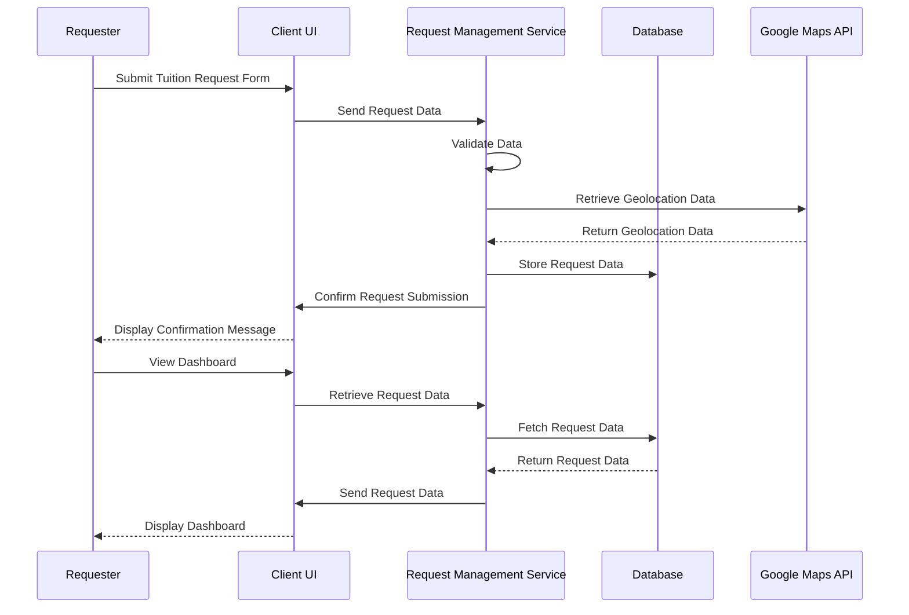

```mermaid
sequenceDiagram
    participant Requester
    participant ClientUI as Client UI
    participant ReqService as Request Management Service
    participant DB as Database
    participant GeoAPI as Google Maps API

    Requester->>ClientUI: Submit Tuition Request Form
    ClientUI->>ReqService: Send Request Data
    ReqService->>ReqService: Validate Data
    ReqService->>GeoAPI: Retrieve Geolocation Data
    GeoAPI-->>ReqService: Return Geolocation Data
    ReqService->>DB: Store Request Data
    ReqService->>ClientUI: Confirm Request Submission
    ClientUI-->>Requester: Display Confirmation Message
    Requester->>ClientUI: View Dashboard
    ClientUI->>ReqService: Retrieve Request Data
    ReqService->>DB: Fetch Request Data
    DB-->>ReqService: Return Request Data
    ReqService->>ClientUI: Send Request Data
    ClientUI-->>Requester: Display Dashboard
```