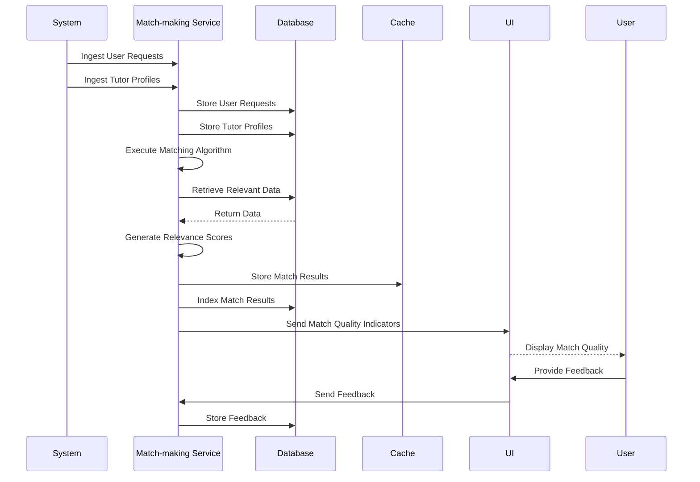

```mermaid
sequenceDiagram
    participant System
    participant MatchService as Match-making Service
    participant DB as Database
    participant Cache
    participant UI

    System->>MatchService: Ingest User Requests
    System->>MatchService: Ingest Tutor Profiles
    MatchService->>DB: Store User Requests
    MatchService->>DB: Store Tutor Profiles
    MatchService->>MatchService: Execute Matching Algorithm
    MatchService->>DB: Retrieve Relevant Data
    DB-->>MatchService: Return Data
    MatchService->>MatchService: Generate Relevance Scores
    MatchService->>Cache: Store Match Results
    MatchService->>DB: Index Match Results
    MatchService->>UI: Send Match Quality Indicators
    UI-->>User: Display Match Quality
    User->>UI: Provide Feedback
    UI->>MatchService: Send Feedback
    MatchService->>DB: Store Feedback
```