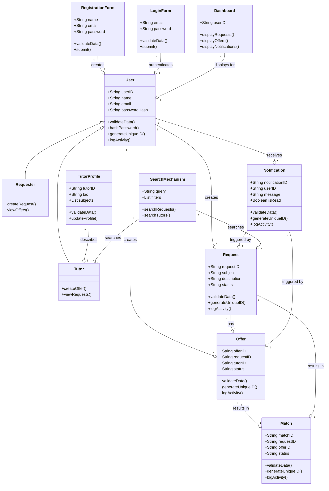

```mermaid
classDiagram
    class User {
        +String userID
        +String name
        +String email
        +String passwordHash
        +validateData()
        +hashPassword()
        +generateUniqueID()
        +logActivity()
    }
    class Requester {
        +createRequest()
        +viewOffers()
    }
    class Tutor {
        +createOffer()
        +viewRequests()
    }
    class Request {
        +String requestID
        +String subject
        +String description
        +String status
        +validateData()
        +generateUniqueID()
        +logActivity()
    }
    class Offer {
        +String offerID
        +String requestID
        +String tutorID
        +String status
        +validateData()
        +generateUniqueID()
        +logActivity()
    }
    class Notification {
        +String notificationID
        +String userID
        +String message
        +Boolean isRead
        +validateData()
        +generateUniqueID()
        +logActivity()
    }
    class Match {
        +String matchID
        +String requestID
        +String offerID
        +String status
        +validateData()
        +generateUniqueID()
        +logActivity()
    }
    class RegistrationForm {
        +String name
        +String email
        +String password
        +validateData()
        +submit()
    }
    class LoginForm {
        +String email
        +String password
        +validateData()
        +submit()
    }
    class TutorProfile {
        +String tutorID
        +String bio
        +List<String> subjects
        +validateData()
        +updateProfile()
    }
    class Dashboard {
        +String userID
        +displayRequests()
        +displayOffers()
        +displayNotifications()
    }
    class SearchMechanism {
        +String query
        +List<String> filters
        +searchRequests()
        +searchTutors()
    }

    User <|-- Requester
    User <|-- Tutor
    User "1" --o "*" Request : creates
    User "1" --o "*" Offer : creates
    User "1" --o "*" Notification : receives
    Request "1" --o "*" Offer : has
    Offer "1" --o "1" Match : results in
    Request "1" --o "1" Match : results in
    Notification "*" --o "1" Offer : triggered by
    Notification "*" --o "1" Request : triggered by
    RegistrationForm "1" --o "1" User : creates
    LoginForm "1" --o "1" User : authenticates
    TutorProfile "1" --o "1" Tutor : describes
    Dashboard "1" --o "1" User : displays for
    SearchMechanism "1" --o "*" Request : searches
    SearchMechanism "1" --o "*" Tutor : searches
```