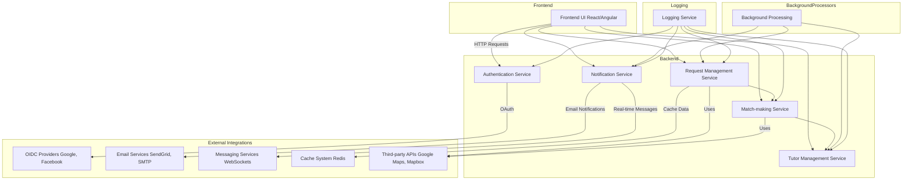

```mermaid
graph TB

    subgraph Frontend
        UI[Frontend UI React/Angular]
    end

    subgraph Backend
        Auth[Authentication Service]
        Req[Request Management Service]
        Tutor[Tutor Management Service]
        Notify[Notification Service]
        Match[Match-making Service]
    end

    subgraph External Integrations
        OIDC[OIDC Providers Google, Facebook]
        Email[Email Services SendGrid, SMTP]
        Msg[Messaging Services WebSockets]
        Cache[Cache System Redis]
        APIs[Third-party APIs Google Maps, Mapbox]
    end

    subgraph BackgroundProcessors
        Task[Background Processing]
    end

    subgraph Logging
        Log[Logging Service]
    end

    UI --> |HTTP Requests| Auth
    UI --> Req
    UI --> Tutor
    UI --> Notify
    UI --> Match

    Auth --> |OAuth| OIDC
    Notify --> |Email Notifications| Email
    Notify --> |Real-time Messages| Msg
    Req --> |Cache Data| Cache

    Req --> Match
    Match --> Tutor

    Task --> Req
    Task --> Tutor
    Task --> Notify

    Log --> Auth
    Log --> Req
    Log --> Tutor
    Log --> Notify
    Log --> Match

    Req --> |Uses| APIs
    Match --> |Uses| APIs
```