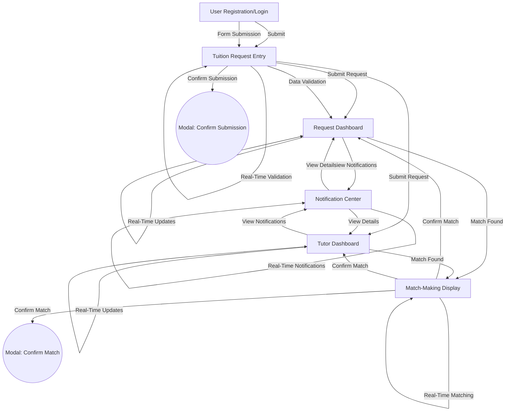

```mermaid
flowchart TD
    %% Define the main screens
    A[User Registration/Login] -->|Submit| B[Tuition Request Entry]
    B -->|Submit Request| C[Request Dashboard]
    B -->|Submit Request| D[Tutor Dashboard]
    C -->|View Notifications| E[Notification Center]
    D -->|View Notifications| E
    C -->|Match Found| F[Match-Making Display]
    D -->|Match Found| F
    
    %% Define interactions and components
    A -->|Form Submission| B
    B -->|Data Validation| C
    C -->|Filter/Sort Requests| C
    D -->|Filter/Sort Requests| D
    E -->|View Details| C
    E -->|View Details| D
    F -->|Confirm Match| C
    F -->|Confirm Match| D
    
    %% Define modal/dialog components
    B -->|Confirm Submission| G((Modal: Confirm Submission))
    F -->|Confirm Match| H((Modal: Confirm Match))
    
    %% Define real-time feedback interactions
    B -->|Real-Time Validation| B
    C -->|Real-Time Updates| C
    D -->|Real-Time Updates| D
    E -->|Real-Time Notifications| E
    F -->|Real-Time Matching| F
```