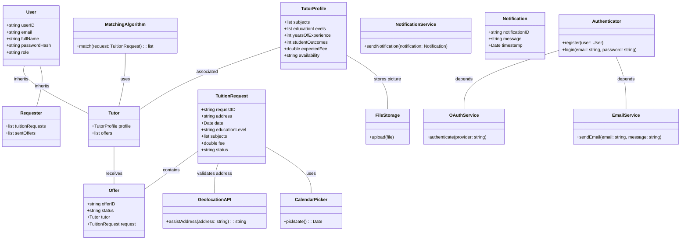

```mermaid
classDiagram

class User {
  +string userID
  +string email
  +string fullName
  +string passwordHash
  +string role
}

class Tutor {
  +TutorProfile profile
  +list<Offer> offers
}

class Requester {
  +list<TuitionRequest> tuitionRequests
  +list<Offer> sentOffers
}

User -- Tutor : inherits
User -- Requester : inherits

class TuitionRequest {
  +string requestID
  +string address
  +Date date
  +string educationLevel
  +list<string> subjects
  +double fee
  +string status
}

class Offer {
  +string offerID
  +string status
  +Tutor tutor
  +TuitionRequest request
}

TuitionRequest -- Offer : contains
Tutor -- Offer : receives

class TutorProfile {
  +list<string> subjects
  +list<string> educationLevels
  +int yearsOfExperience
  +int studentOutcomes
  +double expectedFee
  +string availability
}

TutorProfile -- Tutor : associated

class MatchingAlgorithm {
  +match(request: TuitionRequest) : list<Tutor>
}

class NotificationService {
  +sendNotification(notification: Notification)
}

class Notification {
  +string notificationID
  +string message
  +Date timestamp
}

class Authenticator {
  +register(user: User)
  +login(email: string, password: string)
}

class OAuthService {
  +authenticate(provider: string)
}

class EmailService {
  +sendEmail(email: string, message: string)
}

class GeolocationAPI {
  +assistAddress(address: string) : string
}

class CalendarPicker {
  +pickDate() : Date
}

class FileStorage {
  +upload(file)
}

MatchingAlgorithm -- Tutor : uses
Authenticator -- OAuthService : depends
Authenticator -- EmailService : depends
TuitionRequest -- GeolocationAPI : validates address
TuitionRequest -- CalendarPicker : uses
TutorProfile -- FileStorage : stores picture

end
```