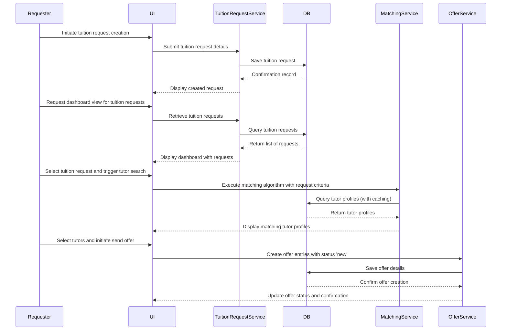

```mermaid
sequenceDiagram
participant Requester
participant UI
participant TuitionRequestService
participant DB
participant MatchingService
participant OfferService

%% Create Tuition Request
Requester ->> UI: Initiate tuition request creation
UI ->> TuitionRequestService: Submit tuition request details
TuitionRequestService ->> DB: Save tuition request
DB -->> TuitionRequestService: Confirmation record
TuitionRequestService -->> UI: Display created request

%% View and Manage Tuition Requests
Requester ->> UI: Request dashboard view for tuition requests
UI ->> TuitionRequestService: Retrieve tuition requests
TuitionRequestService ->> DB: Query tuition requests
DB -->> TuitionRequestService: Return list of requests
TuitionRequestService -->> UI: Display dashboard with requests

%% Search for Matching Tutors
Requester ->> UI: Select tuition request and trigger tutor search
UI ->> MatchingService: Execute matching algorithm with request criteria
MatchingService ->> DB: Query tutor profiles (with caching)
DB -->> MatchingService: Return tutor profiles
MatchingService -->> UI: Display matching tutor profiles

%% Send Offers to Tutors
Requester ->> UI: Select tutors and initiate send offer
UI ->> OfferService: Create offer entries with status 'new'
OfferService ->> DB: Save offer details
DB -->> OfferService: Confirm offer creation
OfferService -->> UI: Update offer status and confirmation
```