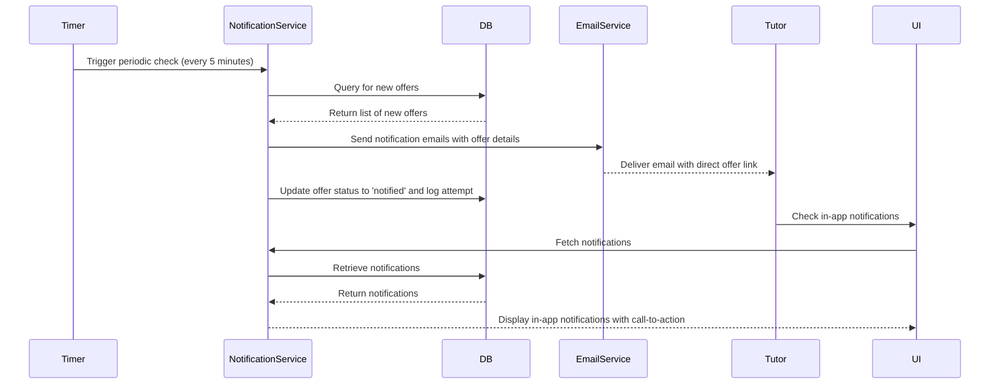

```mermaid
sequenceDiagram
participant Timer
participant NotificationService
participant DB
participant EmailService
participant Tutor

%% Automated Tutor Notifications
Timer ->> NotificationService: Trigger periodic check (every 5 minutes)
NotificationService ->> DB: Query for new offers
DB -->> NotificationService: Return list of new offers
NotificationService ->> EmailService: Send notification emails with offer details
EmailService -->> Tutor: Deliver email with direct offer link
NotificationService ->> DB: Update offer status to 'notified' and log attempt

%% Tutor Notification Reception
Tutor ->> UI: Check in-app notifications
UI ->> NotificationService: Fetch notifications
NotificationService ->> DB: Retrieve notifications
DB -->> NotificationService: Return notifications
NotificationService -->> UI: Display in-app notifications with call-to-action
```