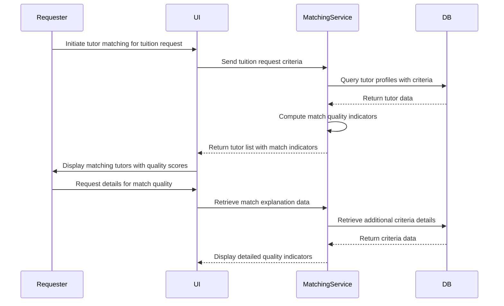

```mermaid
sequenceDiagram
participant Requester
participant UI
participant MatchingService
participant DB

%% Matching Requesters with Tutors
Requester ->> UI: Initiate tutor matching for tuition request
UI ->> MatchingService: Send tuition request criteria
MatchingService ->> DB: Query tutor profiles with criteria
DB -->> MatchingService: Return tutor data
MatchingService ->> MatchingService: Compute match quality indicators
MatchingService -->> UI: Return tutor list with match indicators
UI ->> Requester: Display matching tutors with quality scores

%% Display Match Quality Indicators
Requester ->> UI: Request details for match quality
UI ->> MatchingService: Retrieve match explanation data
MatchingService ->> DB: Retrieve additional criteria details
DB -->> MatchingService: Return criteria data
MatchingService -->> UI: Display detailed quality indicators
```