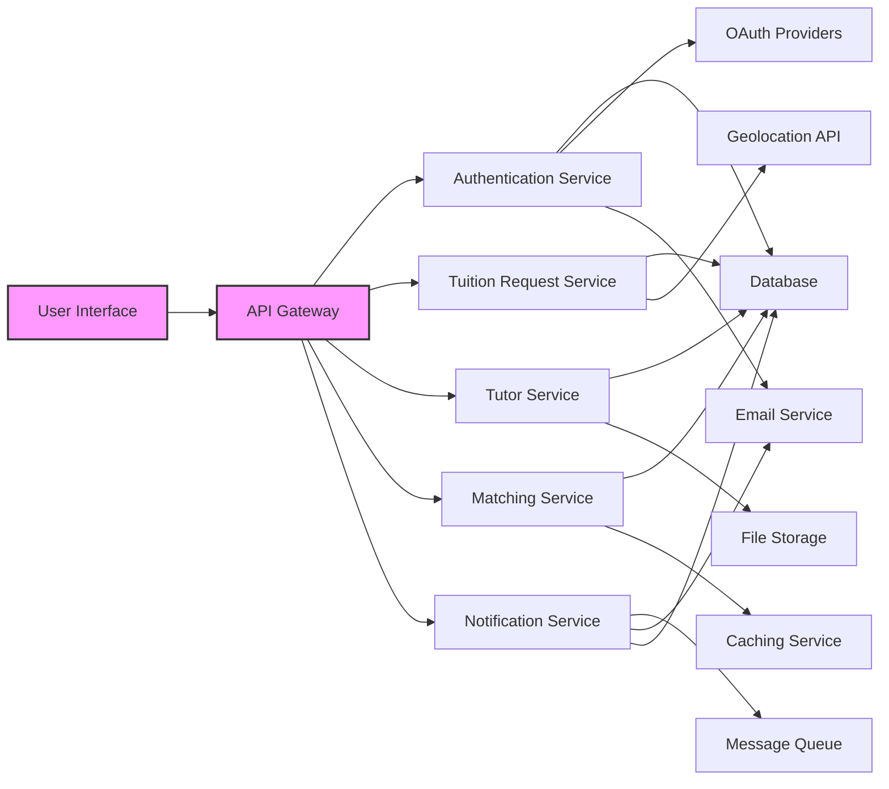

```mermaid
graph LR
  UI[User Interface]
  API[API Gateway]
  Auth[Authentication Service]
  TuitionReq[Tuition Request Service]
  Tutor[ Tutor Service]
  Matching[Matching Service]
  Notification[Notification Service]

  OAuth[OAuth Providers]
  Email[Email Service]
  Geo[Geolocation API]
  FileStorage[File Storage]
  Cache[Caching Service]
  MQ[Message Queue]
  DB[Database]

  UI --> API
  API --> Auth
  API --> TuitionReq
  API --> Tutor
  API --> Matching
  API --> Notification

  Auth --> DB
  Auth --> OAuth
  Auth --> Email

  TuitionReq --> DB
  TuitionReq --> Geo

  Tutor --> DB
  Tutor --> FileStorage

  Matching --> DB
  Matching --> Cache

  Notification --> MQ
  Notification --> Email
  Notification --> DB

  style UI fill:#f9f,stroke:#333,stroke-width:2px
  style API fill:#f9f,stroke:#333,stroke-width:2px
```