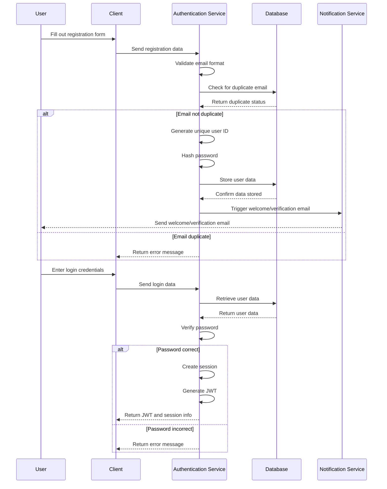

```mermaid
sequenceDiagram
    participant User
    participant Client
    participant AuthService as Authentication Service
    participant DB as Database
    participant NotifService as Notification Service

    User->>Client: Fill out registration form
    Client->>AuthService: Send registration data
    AuthService->>AuthService: Validate email format
    AuthService->>DB: Check for duplicate email
    DB-->>AuthService: Return duplicate status
    alt Email not duplicate
        AuthService->>AuthService: Generate unique user ID
        AuthService->>AuthService: Hash password
        AuthService->>DB: Store user data
        DB-->>AuthService: Confirm data stored
        AuthService->>NotifService: Trigger welcome/verification email
        NotifService-->>User: Send welcome/verification email
    else Email duplicate
        AuthService-->>Client: Return error message
    end

    User->>Client: Enter login credentials
    Client->>AuthService: Send login data
    AuthService->>DB: Retrieve user data
    DB-->>AuthService: Return user data
    AuthService->>AuthService: Verify password
    alt Password correct
        AuthService->>AuthService: Create session
        AuthService->>AuthService: Generate JWT
        AuthService-->>Client: Return JWT and session info
    else Password incorrect
        AuthService-->>Client: Return error message
    end
```