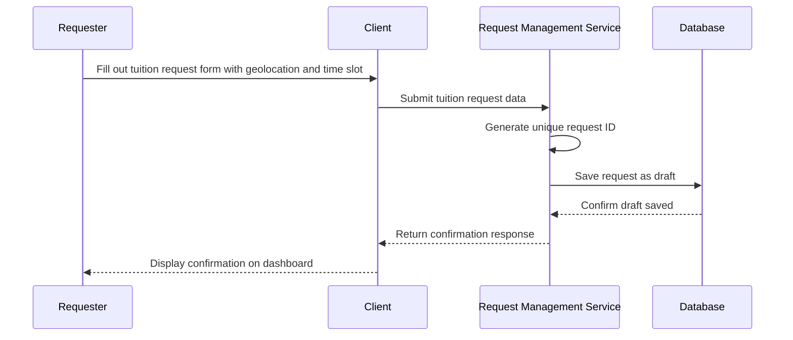

```mermaid
sequenceDiagram
    participant Requester
    participant Client
    participant ReqMgmtService as Request Management Service
    participant DB as Database

    Requester->>Client: Fill out tuition request form with geolocation and time slot
    Client->>ReqMgmtService: Submit tuition request data
    ReqMgmtService->>ReqMgmtService: Generate unique request ID
    ReqMgmtService->>DB: Save request as draft
    DB-->>ReqMgmtService: Confirm draft saved
    ReqMgmtService-->>Client: Return confirmation response
    Client-->>Requester: Display confirmation on dashboard
```