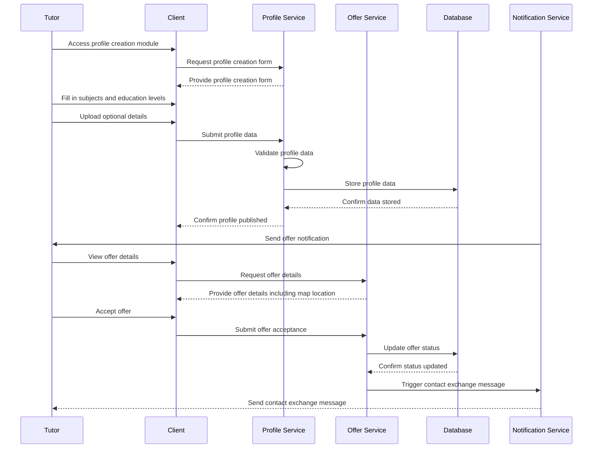

```mermaid
sequenceDiagram
    participant Tutor
    participant Client
    participant ProfileService as Profile Service
    participant OfferService as Offer Service
    participant DB as Database
    participant NotifService as Notification Service

    Tutor->>Client: Access profile creation module
    Client->>ProfileService: Request profile creation form
    ProfileService-->>Client: Provide profile creation form
    Tutor->>Client: Fill in subjects and education levels
    Tutor->>Client: Upload optional details
    Client->>ProfileService: Submit profile data
    ProfileService->>ProfileService: Validate profile data
    ProfileService->>DB: Store profile data
    DB-->>ProfileService: Confirm data stored
    ProfileService-->>Client: Confirm profile published

    NotifService->>Tutor: Send offer notification
    Tutor->>Client: View offer details
    Client->>OfferService: Request offer details
    OfferService-->>Client: Provide offer details including map location
    Tutor->>Client: Accept offer
    Client->>OfferService: Submit offer acceptance
    OfferService->>DB: Update offer status
    DB-->>OfferService: Confirm status updated
    OfferService->>NotifService: Trigger contact exchange message
    NotifService-->>Tutor: Send contact exchange message
```