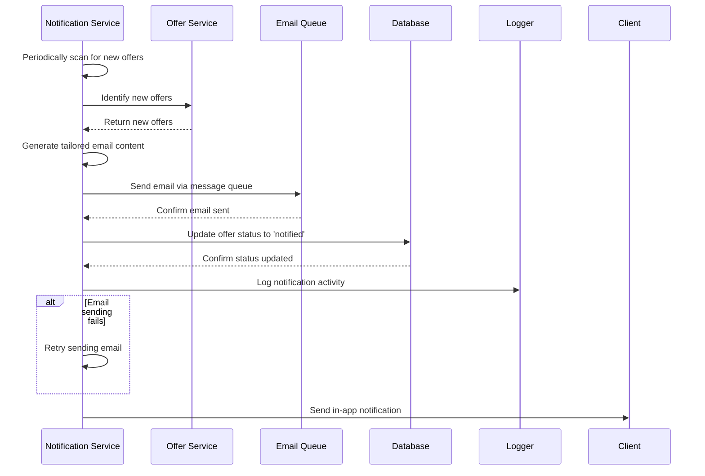

```mermaid
sequenceDiagram
    participant NotifService as Notification Service
    participant OfferService as Offer Service
    participant EmailQueue as Email Queue
    participant DB as Database
    participant Logger

    NotifService->>NotifService: Periodically scan for new offers
    NotifService->>OfferService: Identify new offers
    OfferService-->>NotifService: Return new offers
    NotifService->>NotifService: Generate tailored email content
    NotifService->>EmailQueue: Send email via message queue
    EmailQueue-->>NotifService: Confirm email sent
    NotifService->>DB: Update offer status to 'notified'
    DB-->>NotifService: Confirm status updated
    NotifService->>Logger: Log notification activity
    alt Email sending fails
        NotifService->>NotifService: Retry sending email
    end
    NotifService->>Client: Send in-app notification
```