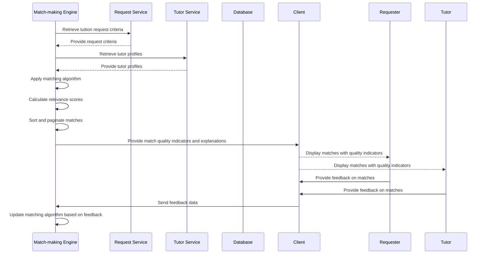

```mermaid
sequenceDiagram
    participant MatchEngine as Match-making Engine
    participant ReqService as Request Service
    participant TutorService as Tutor Service
    participant DB as Database
    participant Client
    participant Requester
    participant Tutor

    MatchEngine->>ReqService: Retrieve tuition request criteria
    ReqService-->>MatchEngine: Provide request criteria
    MatchEngine->>TutorService: Retrieve tutor profiles
    TutorService-->>MatchEngine: Provide tutor profiles
    MatchEngine->>MatchEngine: Apply matching algorithm
    MatchEngine->>MatchEngine: Calculate relevance scores
    MatchEngine->>MatchEngine: Sort and paginate matches
    MatchEngine->>Client: Provide match quality indicators and explanations
    Client-->>Requester: Display matches with quality indicators
    Client-->>Tutor: Display matches with quality indicators
    Requester->>Client: Provide feedback on matches
    Tutor->>Client: Provide feedback on matches
    Client->>MatchEngine: Send feedback data
    MatchEngine->>MatchEngine: Update matching algorithm based on feedback
```