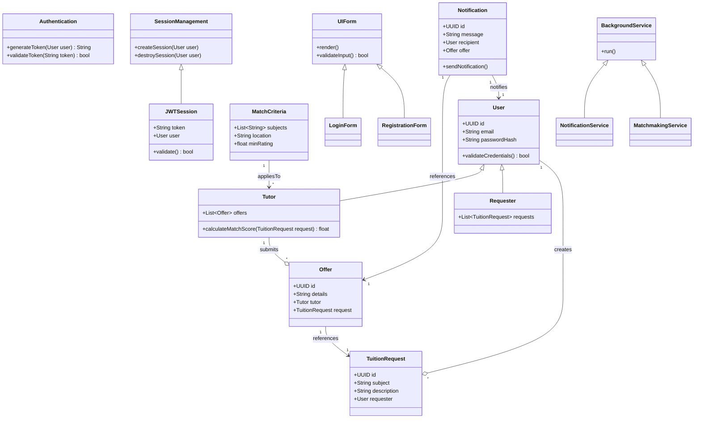

```mermaid
classDiagram
    class User {
        +UUID id
        +String email
        +String passwordHash
        +validateCredentials() bool
    }
    class Tutor {
        +List~Offer~ offers
        +calculateMatchScore(TuitionRequest request) float
    }
    class Requester {
        +List~TuitionRequest~ requests
    }
    class Authentication {
        +generateToken(User user) String
        +validateToken(String token) bool
    }
    class TuitionRequest {
        +UUID id
        +String subject
        +String description
        +User requester
    }
    class Offer {
        +UUID id
        +String details
        +Tutor tutor
        +TuitionRequest request
    }
    class Notification {
        +UUID id
        +String message
        +User recipient
        +Offer offer
        +sendNotification()
    }
    class MatchCriteria {
        +List~String~ subjects
        +String location
        +float minRating
    }
    class UIForm {
        +render()
        +validateInput() bool
    }
    class SessionManagement {
        +createSession(User user)
        +destroySession(User user)
    }
    class BackgroundService {
        +run()
    }
    class JWTSession {
        +String token
        +User user
        +validate() bool
    }
    User <|-- Tutor
    User <|-- Requester
    User "1" --o "*" TuitionRequest : creates
    Tutor "1" --o "*" Offer : submits
    Offer "1" --> "1" TuitionRequest : references
    Notification "1" --> "1" Offer : references
    Notification "1" --> "1" User : notifies
    MatchCriteria "1" --> "*" Tutor : appliesTo
    UIForm <|-- LoginForm
    UIForm <|-- RegistrationForm
    SessionManagement <|-- JWTSession
    BackgroundService <|-- NotificationService
    BackgroundService <|-- MatchmakingService
```