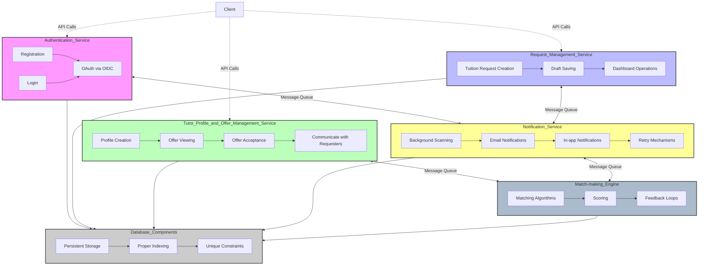

```mermaid
graph TD;
    subgraph Authentication_Service
        A1["Registration"]
        A2["Login"]
        A3["OAuth via OIDC"]
        A1 --> A3
        A2 --> A3
    end

    subgraph Request_Management_Service
        R1["Tuition Request Creation"]
        R2["Draft Saving"]
        R3["Dashboard Operations"]
        R1 --> R2
        R2 --> R3
    end

    subgraph Tutor_Profile_and_Offer_Management_Service
        T1["Profile Creation"]
        T2["Offer Viewing"]
        T3["Offer Acceptance"]
        T4["Communicate with Requesters"]
        T1 --> T2
        T2 --> T3
        T3 --> T4
    end

    subgraph Notification_Service
        N1["Background Scanning"]
        N2["Email Notifications"]
        N3["In-app Notifications"]
        N4["Retry Mechanisms"]
        N1 --> N2
        N2 --> N3
        N3 --> N4
    end

    subgraph Match-making_Engine
        M1["Matching Algorithms"]
        M2["Scoring"]
        M3["Feedback Loops"]
        M1 --> M2
        M2 --> M3
    end

    Client -.-> |API Calls| Authentication_Service
    Client -.-> |API Calls| Request_Management_Service
    Client -.-> |API Calls| Tutor_Profile_and_Offer_Management_Service

    Authentication_Service <--> |Message Queue| Notification_Service
    Request_Management_Service <--> |Message Queue| Notification_Service
    Tutor_Profile_and_Offer_Management_Service <--> |Message Queue| Match-making_Engine
    Notification_Service <--> |Message Queue| Match-making_Engine

    subgraph Database_Components
        D1["Persistent Storage"]
        D2["Proper Indexing"]
        D3["Unique Constraints"]
        D1 --> D2 --> D3
    end

    Authentication_Service --> Database_Components
    Request_Management_Service --> Database_Components
    Tutor_Profile_and_Offer_Management_Service --> Database_Components
    Notification_Service --> Database_Components
    Match-making_Engine --> Database_Components

    style Authentication_Service fill:#f9f,stroke:#333,stroke-width:2px
    style Request_Management_Service fill:#bbf,stroke:#333,stroke-width:2px
    style Tutor_Profile_and_Offer_Management_Service fill:#bfb,stroke:#333,stroke-width:2px
    style Notification_Service fill:#ff9,stroke:#333,stroke-width:2px
    style Match-making_Engine fill:#abc,stroke:#333,stroke-width:2px
    style Database_Components fill:#ccc,stroke:#333,stroke-width:2px
```