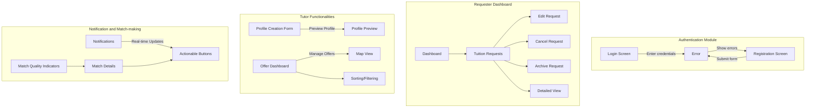

```mermaid
graph TB
    subgraph Authentication Module
        Login[Login Screen]
        Registration[Registration Screen]
        Login -->|"Enter credentials"| Error
        Registration -->|"Submit form"| Error
        Error -->|"Show errors"| Registration
    end

    subgraph Requester Dashboard
        Dashboard[Dashboard]
        TuitionRequest[Tuition Requests]
        Dashboard --> TuitionRequest
        TuitionRequest --> EditRequest[Edit Request]
        TuitionRequest --> CancelRequest[Cancel Request]
        TuitionRequest --> ArchiveRequest[Archive Request]
        TuitionRequest --> DetailedView[Detailed View]
    end

    subgraph Tutor Functionalities
        ProfileForm[Profile Creation Form]
        OfferDashboard[Offer Dashboard]
        ProfileForm -->|"Preview Profile"| ProfilePreview[Profile Preview]
        OfferDashboard -->|"Manage Offers"| MapView[Map View]
        OfferDashboard --> SortingFiltering[Sorting/Filtering]
    end

    subgraph Notification and Match-making
        Notifications[Notifications]
        MatchQuality[Match Quality Indicators]
        MatchDetails[Match Details]
        Notifications -->|"Real-time Updates"| ActionButtons[Actionable Buttons]
        MatchQuality --> MatchDetails
        MatchDetails --> ActionButtons
    end
```