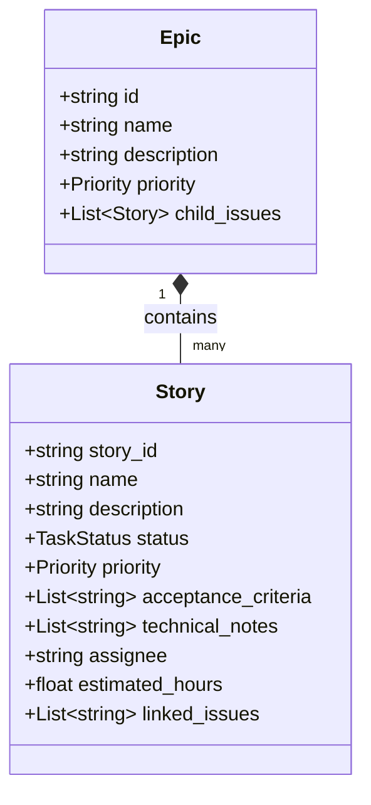

```mermaid
classDiagram
    class Epic {
      +string id
      +string name
      +string description
      +Priority priority
      +List~Story~ child_issues
    }
    class Story {
      +string story_id
      +string name
      +string description
      +TaskStatus status
      +Priority priority
      +List~string~ acceptance_criteria
      +List~string~ technical_notes
      +string assignee
      +float estimated_hours
      +List~string~ linked_issues
    }
    Epic "1" *-- "many" Story : contains
```