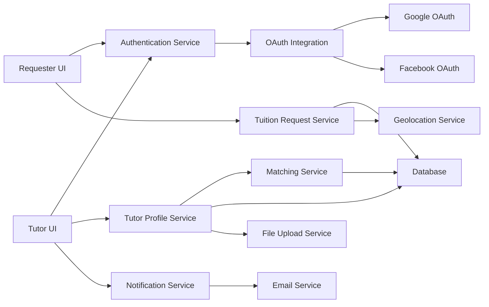

```mermaid
graph LR
    A[Requester UI] --> B[Authentication Service]
    A --> C[Tuition Request Service]
    D[Tutor UI] --> B
    D --> E[Tutor Profile Service]
    E --> F[Matching Service]
    D --> G[Notification Service]
    B --> H[OAuth Integration]
    H --> I[Google OAuth]
    H --> J[Facebook OAuth]
    C --> K[Database]
    E --> K
    F --> K
    G --> L[Email Service]
    C --> M[Geolocation Service]
    E --> N[File Upload Service]
```