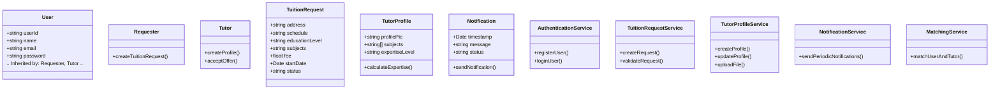

```mermaid
classDiagram
  class User {
      +string userId
      +string name
      +string email
      +string password
      .. Inherited by: Requester, Tutor ..
  }

  class Requester {
      +createTuitionRequest()
  }

  class Tutor {
      +createProfile()
      +acceptOffer()
  }

  class TuitionRequest {
      +string address
      +string schedule
      +string educationLevel
      +string subjects
      +float fee
      +Date startDate
      +string status
  }

  class TutorProfile {
      +string profilePic
      +string[] subjects
      +string expertiseLevel
      +calculateExpertise()
  }

  class Notification {
      +Date timestamp
      +string message
      +string status
      +sendNotification()
  }

  class AuthenticationService {
      +registerUser()
      +loginUser()
  }

  class TuitionRequestService {
      +createRequest()
      +validateRequest()
  }

  class TutorProfileService {
      +createProfile()
      +updateProfile()
      +uploadFile()
  }

  class NotificationService {
      +sendPeriodicNotifications()
  }

  class MatchingService {
      +matchUserAndTutor()
  }
```
