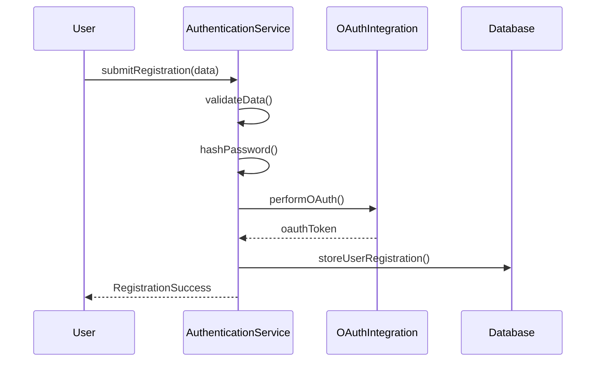

```mermaid
sequenceDiagram
    participant User
    participant AuthenticationService
    participant OAuthIntegration
    participant Database

    User->>AuthenticationService: submitRegistration(data)
    AuthenticationService->>AuthenticationService: validateData()
    AuthenticationService->>AuthenticationService: hashPassword()
    AuthenticationService->>OAuthIntegration: performOAuth()
    OAuthIntegration-->>AuthenticationService: oauthToken
    AuthenticationService->>Database: storeUserRegistration()
    AuthenticationService-->>User: RegistrationSuccess
```