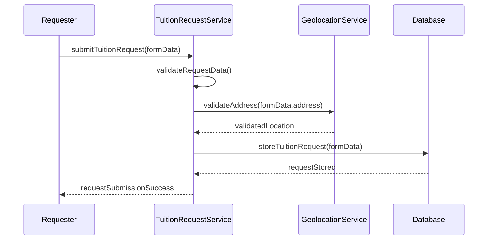

```mermaid
sequenceDiagram
    participant Requester
    participant TuitionRequestService
    participant GeolocationService
    participant Database

    Requester->>TuitionRequestService: submitTuitionRequest(formData)
    TuitionRequestService->>TuitionRequestService: validateRequestData()
    TuitionRequestService->>GeolocationService: validateAddress(formData.address)
    GeolocationService-->>TuitionRequestService: validatedLocation
    TuitionRequestService->>Database: storeTuitionRequest(formData)
    Database-->>TuitionRequestService: requestStored
    TuitionRequestService-->>Requester: requestSubmissionSuccess
```