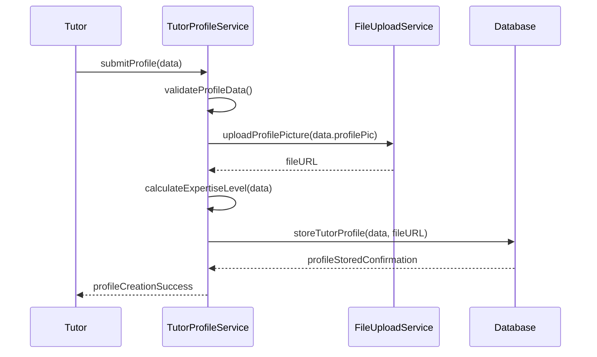

```mermaid
sequenceDiagram
    participant Tutor
    participant TutorProfileService
    participant FileUploadService
    participant Database

    Tutor->>TutorProfileService: submitProfile(data)
    TutorProfileService->>TutorProfileService: validateProfileData()
    TutorProfileService->>FileUploadService: uploadProfilePicture(data.profilePic)
    FileUploadService-->>TutorProfileService: fileURL
    TutorProfileService->>TutorProfileService: calculateExpertiseLevel(data)
    TutorProfileService->>Database: storeTutorProfile(data, fileURL)
    Database-->>TutorProfileService: profileStoredConfirmation
    TutorProfileService-->>Tutor: profileCreationSuccess
```