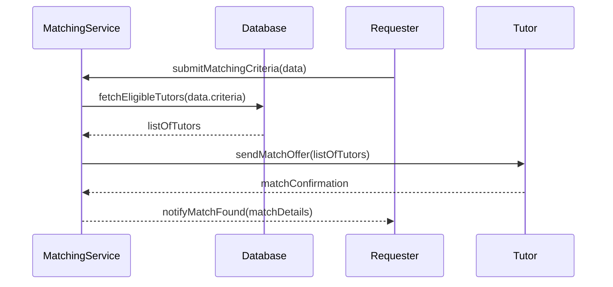

```mermaid
sequenceDiagram
    participant MatchingService
    participant Database
    participant Requester
    participant Tutor

    Requester->>MatchingService: submitMatchingCriteria(data)
    MatchingService->>Database: fetchEligibleTutors(data.criteria)
    Database-->>MatchingService: listOfTutors
    MatchingService->>Tutor: sendMatchOffer(listOfTutors)
    Tutor-->>MatchingService: matchConfirmation
    MatchingService-->>Requester: notifyMatchFound(matchDetails)
```